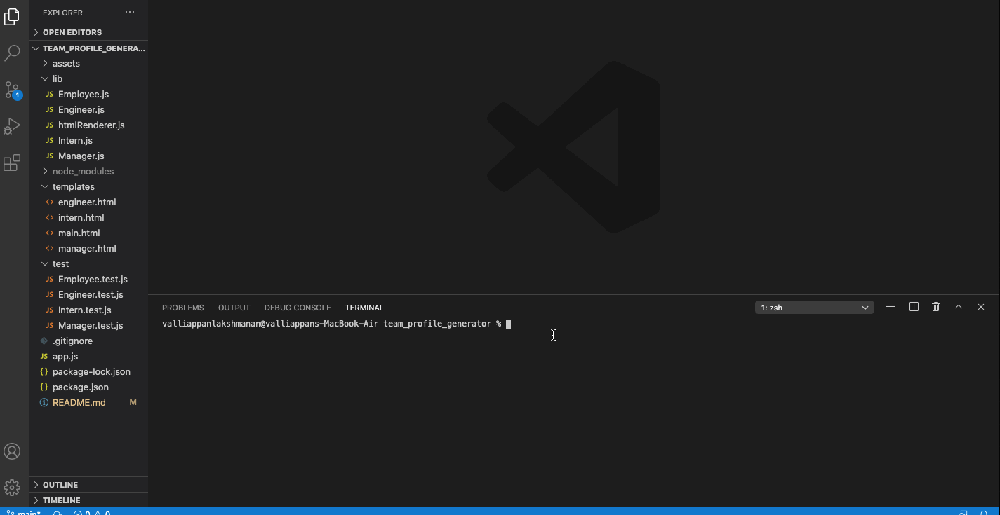

# team_profile_generator

The following is a CLI application that takes in input from the user and generates an HTML file that displays information about each member on the team. 

# Table of Contents 

* [Tech used](#Tech%20used)
* [Installation](#Installation)
* [Usage](#Usage)
* [Questions](#Questions)

# Tech used 
* Node/npm 
* inquirer
* Javascript Classes
* Modular Javascript
* Node File System 

# Installation 

Installation is pretty simple. Fork and clone this repo to your computer. Before running the code in this repo don't forget to run 'npm install' 

## Usage 

Using the app is also straight forward. Open up your terminal/bash command lind interface and navigate to the project directory. Once your in that directory, run "node app.js" in your terminal. You will then be prompted to go through and add members of your team and information about each of those members. Still confused? Check out the gif attached below or linked [here](./assets/screen_capture.gif). 

## Questions

Still confused? Think there is a better way I can write my code? Did I miss a key part of functionality? Let me know! Just drop me message on github.
